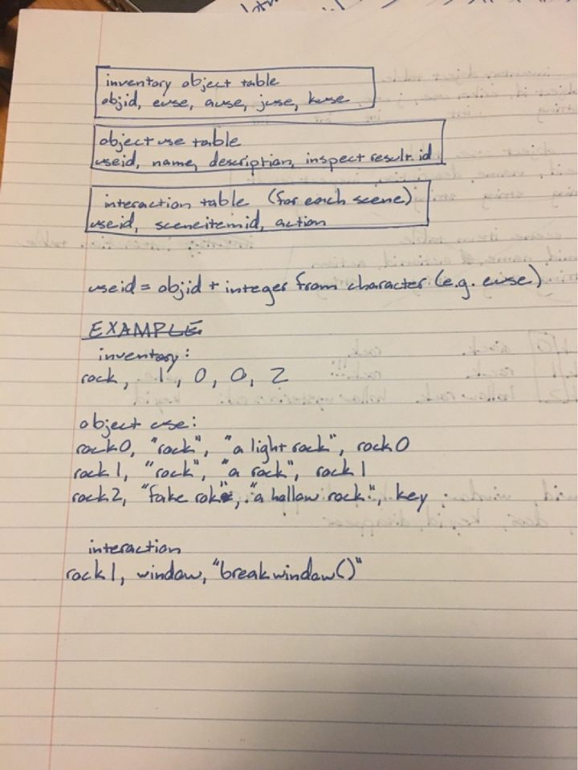

## We're a bit loud | GAMING | Brains, Brawn, and Bambi
`Joan Wong`
`Alexandra Wheeler`
`Erika Snow`
`Krysta Murdy`

https://a4-jwong3.herokuapp.com/

Single player, point and click, escape the room type game.

There is a tutorial room for a point and click type game. There are four different characters that can be changed. Each character allows the player access to use different items that may be useless to another player. Ie the character joan is the only one that can use the lighter. There is a scoring mechanism in which the score is calculated based on time. 
You currently cannot switch a character during a level.

You can click the chacacter in the table on the right, but it doesn't acutally change what character you are mid game.
We are having a few sync issues with the game. You may need to press the inspect button a few times for it to respond. Please be patient. These will be fixed in the final.
Also there may be issues with the scaling of the pictures.

Images are encouraged, along with concise, high-level text.

## Technical Achievements
- **Tech Achievement 1**: As shown in `sceneHandler.js`, we have managed to move images when they are clicked so that we can hide objects behind other objects in the screen
- **Tech Achievement 2**: Allowed different character options, each with a unique playthrough of the game. For this, we had to make many tables in our database in order to handle different characters interacting with the same objects. 
there also exits a db to hold the scores. However the other tables have persistence  with the .json files.
There is also a dependency for the object use table. One field inspect will have the id of an object in the table. In order for an objectid to be in the inspect field. It needs to have been already defined.ie. the krysta rock can't have the key in the inspect field unless the key has already been defined.
- **Tech Achievement 3**: As shown in `mainScreen.js`, we created global variables using window variables in order to pass information between screens
- **Tech Achievement 4**: Implemented a timer to make the score
- **Tech Achievement 5**: Able to replace a div with another without refreshing the screen

## Design/Evaluation Achievements
- **Design Achievement 1**: Built in scalability so that we can expand for the final project and beyond
- **Design Achievement 2**: Use of our own pictures and royalty free music
- **Design Achievement 3**: Moving images and overlaying them on top of each other
- **Design Achievement 4**: Created a theme and trying to keep with it (try to figure out what the name of the game means)
- **Design Achievement 5**: Tried to separate  functions into various files for ease of coding (and merging)
- **Design Achievement 6**: Our db, we want to make our db as easy as we can. So we have one table to figure out who can use that item, another to tell what the item is and if it changes. And another to tell what the interactions are on the screen. 
